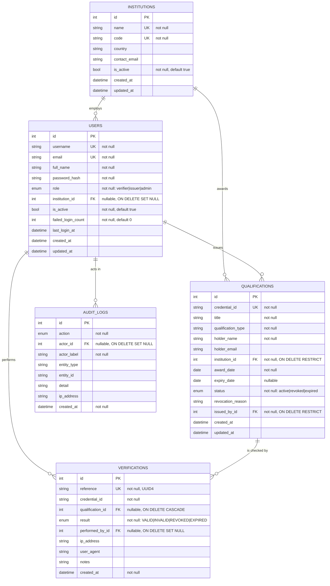

# Database Design

## 1. Entity-relationship model

## 2. Tables

### 2.1 `institutions`

The awarding bodies. `code` is a short human-readable identifier (MSU, UZ) used
in listings and search; `name` is the full legal name. Both are unique.

`is_active` is a soft switch rather than a delete: deactivating stops new
registrations against the institution while leaving every credential it has
already issued intact and verifiable.

### 2.2 `users`

Accounts for the three roles. `role` is stored as a non-native enum
(`native_enum=False`, i.e. a `VARCHAR` with a check constraint) so the same
schema works on both PostgreSQL and SQLite and adding a role does not need a
PostgreSQL `ALTER TYPE`.

`institution_id` is nullable with `ON DELETE SET NULL`: a verifier at an
employer belongs to no awarding institution, and removing an institution must
not remove the people.

`failed_login_count` accumulates consecutive failures and resets on success.
It is recorded for monitoring; it does not currently lock the account, which is
noted as a limitation in `docs/security.md`.

### 2.3 `qualifications`

The register. Constraints:

| Constraint | Purpose |
| --- | --- |
| `uq_qualification_credential_id` | The core integrity rule — one credential ID, one credential. Enforced by the database, not only by the duplicate check in the service. |
| `ck_qualification_expiry_after_award` | `expiry_date IS NULL OR expiry_date >= award_date` |
| `institution_id` FK, `ON DELETE RESTRICT` | An institution with issued credentials cannot be deleted out from under them |
| `issued_by_id` FK, `ON DELETE RESTRICT` | Every credential keeps a traceable issuer |

Indexes: `credential_id` (the verification lookup — the hottest query in the
system), `holder_name`, `title`, `status`, and a composite
`ix_qualification_holder_institution` on `(holder_name, institution_id)` for
"what has this person been awarded by this institution".

`status` stores the administrative state. Expiry is *derived*, not stored, via
`Qualification.effective_status` — a stored expiry flag would be wrong the day
after it was written unless a scheduled job kept it current, and a system whose
correctness depends on a cron job running is a system that will one day be
wrong. Computing it at read time is always correct.

### 2.4 `verifications`

One row per verification attempt, successful or not.

`qualification_id` is **nullable on purpose**: an attempt against an
unregistered reference has no qualification to point at, but is exactly the
event worth keeping. `credential_id` is stored as text alongside the FK so the
attempted reference survives even when it matched nothing.

`reference` is a UUID4 acting as a public receipt identifier. It is used in the
receipt URL rather than the sequential `id`, so receipt links cannot be walked
to enumerate other people's verifications.

Index: `ix_verification_credential_created` on `(credential_id, created_at)`
serves the "history for this credential, newest first" query directly.

### 2.5 `audit_logs`

The append-only trail. `actor_id` is nullable with `ON DELETE SET NULL` and is
accompanied by `actor_label`, a denormalised copy of the username: if the
account is later removed, the trail must still say who did the thing. This is a
deliberate denormalisation — normalising it would let account deletion erase
history.

Immutability is enforced in `app/utils/audit_guard.py` by SQLAlchemy
`before_update` / `before_delete` listeners that raise `ImmutableRecordError`.
Two tests assert both. Note the scope of the guarantee: this stops modification
*through the application*. A database superuser can still alter rows; defending
against that needs database-level permissions or write-once storage, which is
recorded as a limitation.

## 3. Relationships

| From | To | Cardinality | Delete behaviour |
| --- | --- | --- | --- |
| Institution | User | 1 : 0..n | SET NULL |
| Institution | Qualification | 1 : 0..n | RESTRICT |
| User (issuer) | Qualification | 1 : 0..n | RESTRICT |
| User | Verification | 1 : 0..n | SET NULL |
| Qualification | Verification | 1 : 0..n | CASCADE |
| User | AuditLog | 1 : 0..n | SET NULL |

The `Qualification → Verification` cascade is the one place a delete propagates:
verification records for a credential that no longer exists have nothing to
describe. Everything else preserves history.

## 4. Enumerations

| Enum | Values |
| --- | --- |
| `Role` | `verifier`, `issuer`, `admin` |
| `QualificationStatus` | `active`, `revoked`, `expired` |
| `VerificationResult` | `VALID`, `INVALID`, `REVOKED`, `EXPIRED` |
| `AuditAction` | `login.success`, `login.failure`, `logout`, `qualification.created`, `qualification.updated`, `qualification.revoked`, `qualification.reinstated`, `verification.performed`, `user.created`, `user.updated`, `user.deactivated`, `institution.created`, `institution.updated`, `access.denied` |

All are stored as strings with a check constraint rather than native database
enums, for portability between PostgreSQL and SQLite.

## 5. Timestamps

Every table carries `created_at`; mutable tables also carry `updated_at` with an
`onupdate` hook. All are timezone-aware UTC, produced by `models.user.utcnow()`
using `datetime.now(timezone.utc)` — `datetime.utcnow()` is deprecated and
returns a naive value that silently misbehaves across zones.

## 6. Schema management

The baseline schema is created by `db.create_all()` in `docker-entrypoint.sh`,
which makes a fresh deployment work with no manual step. Flask-Migrate
(Alembic) is initialised in the application factory; from the first schema
change onwards, changes go through `flask db migrate` / `flask db upgrade` so
deployed data is preserved. See `migrations/README.md`.

## 7. Indexing rationale

| Index | Query it serves |
| --- | --- |
| `qualifications.credential_id` (unique) | The verification lookup |
| `qualifications.holder_name` | Search by holder |
| `qualifications.title` | Search by qualification title |
| `qualifications.status` | Status filter and dashboard counts |
| `(holder_name, institution_id)` | Holder's credentials at one institution |
| `verifications.credential_id` | History for a credential |
| `(credential_id, created_at)` | That history, ordered, without a sort |
| `verifications.result` | Result filter and dashboard counts |
| `verifications.created_at` | Recent-activity listing |
| `audit_logs.action`, `(action, created_at)` | Filtered audit browsing |
| `users.username`, `users.email` (unique) | Sign-in lookup |
